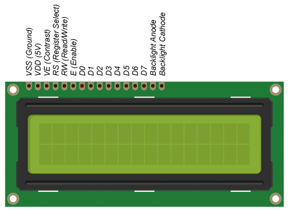

# LCD (Liquid Crystal Display) Library for PIC Microcontrollers

This a 16x2 Character LCD Library using 4-bit communication for PIC microcontrollers (I used PIC18F4585).

For designing custom character: https://omerk.github.io/lcdchargen/

## LCD Pinout

| PIN NAME             | FUNCTION                                                                                                                                                           |
|:----------------------|:------------------------------------------------------------------------------------------------------------------------------------------------------|
| Vss                  | Ground                                                                                                                                                             |
| Vdd                  | 5V                                                                                                                                                                 |
| Ve                   | Contrast Control                                                                                                                                                   |
| RS (Register Select) | 0: For sending instructions 1: For sending data that we want to display                                                                                     |
| RW (Read/Write)      | 0: Write instructions or data to the LCD 1: Read data from the LCD  We can connect this to the ground if we only planning to do writing operation. |
| E (Enable)           | Loads the data present in the data pins to the LCD on thefalling edges.                                                                                    |
| D0:D7 (Data pins)    | In 8-bit communication mode, we use all 8 of them (D7:D0). In 4-bit communication mode, we use only 4 of them (D7:D4).                                      |
| A                    | Anode pin for the backlight. (+5V)                                                                                                                                 |
| K                    | Cathode pin for the backlight. (Ground)                                                                                                                            |                                                                                                                                      |                                                                                                                     |

## LCD HD44780 Instruction List

This table shows the instructions we can send to the HD44780 chip for controlling the LCD and it is taken from the HD44780 datasheet page 24 and 25. 

I calculate the binary representations for most of the commands by arranging the special bits accordingly and represent them with hexadecimal, in the [lcd_lib.h](LCD_lib/lcd_lib.h) file under the Command Set section (Line 28). And using the `lcd_command` function we can send this commands to the LCD in 4 bit communication mode. 

## My Circuit (PIC18F4585)

