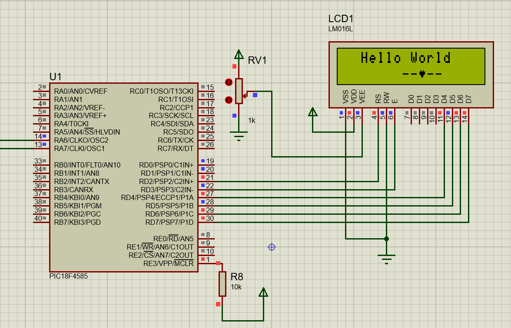

# LCD (Liquid Crystal Display) Library <br> for PIC Microcontrollers

This a 16x2 Character LCD Library using 4-bit communication for PIC microcontrollers (I used PIC18F4585).

I used a 16MHz external crsytal as a clock source for my PIC if you use a different frequency you can change it from the [lcd_lib.h](lcd_lib.h) file line 16.

For designing custom character: https://omerk.github.io/lcdchargen/

## LCD Pinout


| PIN NAME             | FUNCTION                                                                                                                                                           |
|:----------------------|:------------------------------------------------------------------------------------------------------------------------------------------------------|
| Vss                  | Ground                                                                                                                                                             |
| Vdd                  | 5V                                                                                                                                                                 |
| Ve                   | Contrast Control                                                                                                                                                   |
| RS (Register Select) | 0: For sending instructions<br>1: For sending data that we want to display                                                                                     |
| RW (Read/Write)      | 0: Write instructions or data to the LCD<br>1: Read data from the LCD<br><br>We can connect this to the ground if we only planning to do writing operation. |
| E (Enable)           | Loads the data present in the data pins to the LCD on the falling edges.                                                                                    |
| D0:D7 (Data pins)    | In 8-bit communication mode, we use all 8 of them (D7:D0).<br>In 4-bit communication mode, we use only 4 of them (D7:D4).                                      |
| A                    | Anode pin for the backlight. (+5V)                                                                                                                                 |
| K                    | Cathode pin for the backlight. (Ground)                                                                                                                            |                                                                                                                                      |                                                                                                                     |

## LCD HD44780 Instruction List

This table shows the instructions we can send to the HD44780 chip for controlling the LCD and it is taken from the HD44780 datasheet page 24 and 25. 

I calculate the binary representations for most of the commands by arranging the special bits accordingly and represent them with hexadecimal, in the [lcd_lib.h](lcd_lib.h) file under the Command Set section (Line 28). And using the `lcd_command` function we can send this commands to the LCD in 4 bit communication mode. 


## My Circuit (PIC18F4585)

Here is my circuit, in the software Anode and Cathode pins for the backlight are not present but when you are connecting these pins I suggest you to put a current limiting resistor just in case there is no built in one.



Example code shown in the picture:
```ruby
uint8_t customChar1[8] = {
	0b00000, 0b01010, 0b11111, 0b11111, 0b01110, 0b00100, 0b00000, 0b00000
};

void main(void) {
        
    TRISD = 0b00000000;
    LATD = 0b00000000;
    
    lcd_init();
    
    lcd_customchar(0, customChar1);
    
    lcd_gotoxy(2,0);
    lcd_puts("Hello World");
    lcd_gotoxy(7,1);
    lcd_puts("--");
    lcd_putc(0x00);
    lcd_puts("--");
    
    // Infinite Loop
    while(1)
    {

    }
    return;
}
```

